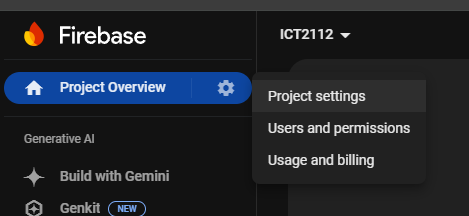
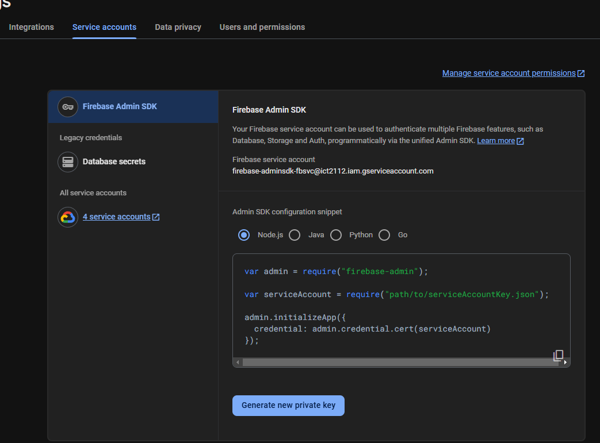
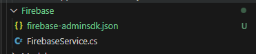

# 📘 ICT2112-Software-Design-SD (ClearCare)
**ClearCare** is a web application designed to streamline the coordination and scheduling of pre-discharge services for patients. The system is structured into three main modules, each representing a distinct set of functionalities to support hospital discharge workflows.

## 🩺 About the Project
ClearCare simplifies the discharge planning process by offering role-based access for healthcare providers, centralized data management, service scheduling, and home safety assessments. It aims to improve communication between medical staff, patients, and caregivers—ensuring safer and more efficient patient transitions from hospital to home.

## 🧩 Modules Overview
### 🧾 Module 1: Account and Data Hub
- 🔐 Handling of accounts, profiles, role-based access
- 👤 Personalized profile page to view and edit information
- 🛠️ Admins are able to reset passwords, delete accounts, and perform other adminnistrative tasks
- 📄 Handling of patient medical records
- 🖋️ Filing of erratum upon amendment of records 
- 🔒 Secure storage and communication of data

### 🏥 Module 2 - Care Servie Orchestrator

- 👩‍⚕️ Assignment of nurses to pre-discharge services
- 🔔 Automated reminders and notifications for patients on upcoming service appointments
- 🗂️ Recording of service history for patients

### 💊 Module 3 - Med Track and Home Safe

- 💬 Medication counselling through reviewing of drug information
- 🏡 Home safety assessments for rehab team to assess risks and recommend modifications
- ☑️ Virtual checklist provided for asessment
- 📄 Documentation of discussions and recommendations for the assessment
- 📹 Online zoom integrated consultations

### ✨ Additional Features
- 🗣️ Feedback system
- ❓ Enquiry system
- 🌐 Community hub for patients and caregivers
- 📃 Discharge summary generator

### 📁 Project Structure
```bash
├───Controllers     # Controllers
├───DataSource      # DataSource
├───Models          # Models
├───Views           # Views (UI) of the project
│   └───Shared      # Base layout, partials
└───wwwroot
    ├───css         # CSS files
    ├───js          # JS files
```

### 🛠 Built With
- ASP.NET Core  
- C#  
- Razor Pages  
- Entity Framework Core  
- Firebase

## 🚀 Getting Started

### ✅ Prerequisites
1. Dotnet SDK

### 🧪 Setup Instructions
1. Clone the repository:
```bash
   git clone https://github.com/jyboat/ICT2112-Software-Design-SD
   cd ClearCare
```

2. Checkout the module you want to run:
🧾 Module 1 (Account and Data Hub)
```bash
   git checkout Module-1
```

🏥 Module 2 (Care Service Orchestrator)
```bash
   git checkout Module-2
```

💊 Module 3 (Med Track and Home Safe)
```bash
   git checkout Module-3
```

3. Run the application:
```bash
    dotnet run
```

4. Open your browser and visit:
```bash
    http://localhost:5007
```

#### Firebase Setup
1. Log into firebase console (https://console.firebase.google.com/u/0/)
2. Click **Project Settings** 



3. Click **Service Accounts** >**Generate new private key**



4. **Rename** .json file to "**firebase-adminsdk.json**"

5. Insert **firebase-adminsdk.json** to "**/ClearCare/Firebase**" folder




<span style="color: red;">❗️**Do not**</span> commit firebase-adminsdk to github repository. Make sure it's ignored in your .gitignore file to protect sensitive credentials.

